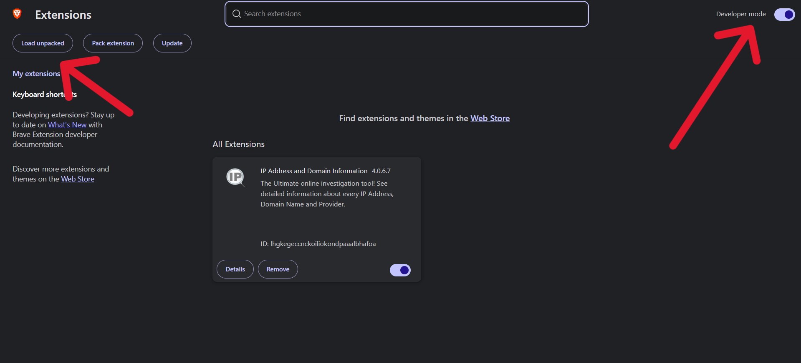
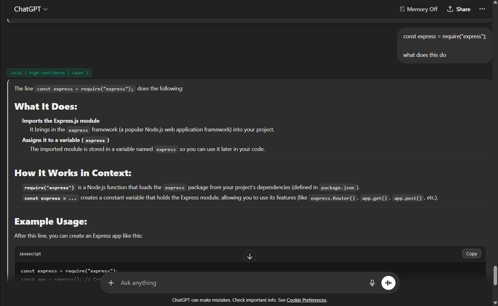
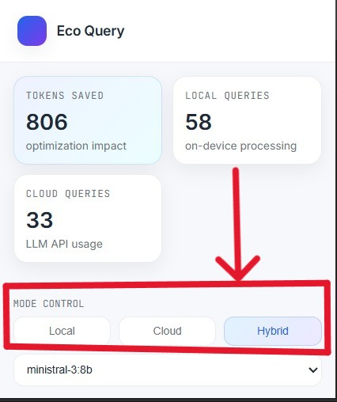
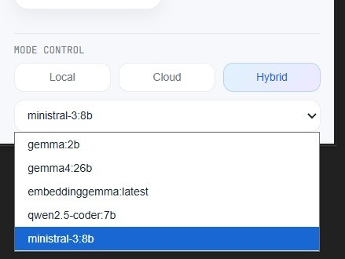

# Eco Query

This project will help you combine the powers of a local LLM with a cloud LLM to give you a hybrid, efficient AI assistant experience. To get started, you will need to have a local LLM running.

## Step 1 - Setting up Ollama
*(Skip this step if you are already running a local LLM on Ollama)*
*(You can also use youtube video for setting up ollama and running a model that matches your system requirements)*
1. Download and install **Ollama** from [ollama.com](https://ollama.com/).
2. Open your terminal or command prompt.
3. Run the following command to download and start a local model (e.g., `mistral`):
   ```bash
   ollama run <model_name>
   ```
4. Ensure the Ollama background service is running on your system.

## Step 2 - Setting up the Extension
**Note:** Ensure that [Node.js](https://nodejs.org/) is installed on your laptop before proceeding, as it is required to install dependencies and build the extension.

1. Clone the repository.
2. Open your terminal in the project directory and run `npm install` to install dependencies.
3. Build the extension by running `npm run build` (or use `npm run watch` if you plan to make changes).
4. Open your Google Chrome browser and navigate to `chrome://extensions/`.
5. Enable **Developer mode** by toggling the switch in the top right corner.
6. Click on the **Load unpacked** button.
7. Select the root folder of this project (the directory containing the extension's `manifest.json` file).



## Step 3 - Usage (ChatGPT)
1. Go to [ChatGPT](https://chatgpt.com).
2. Write your query in the chat box, and the extension will automatically run and process it using the hybrid approach.



## Step 4 - Mode and Model Selection
There is a mode and model selection features available in the extension's popup interface.
1. Click on the Eco Query extension icon in your browser's extension toolbar.
2. You can switch between different modes as well as models to control how your queries are handled between local, cloud and Hybrid.





*(Note: These are the models you have downloaded and can run.)*

---

### Troubleshooting

**Note:** If your local model is not running, please change the mode to Cloud through the popup window by clicking on the "I" icon in the grey box in extension popup.

**Known Bug:** If the extension is not actively working in ChatGPT:
- Try writing a simple query like *"hi"*.
- After receiving a response from ChatGPT, reload the page. This should re-initialize the extension correctly.


